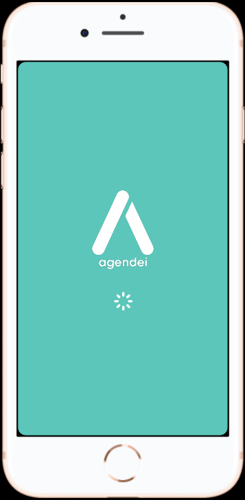
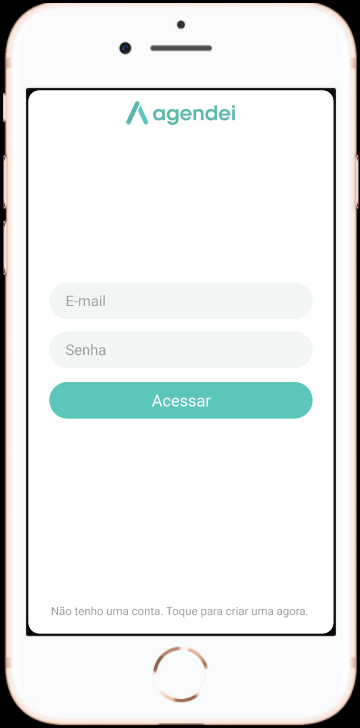
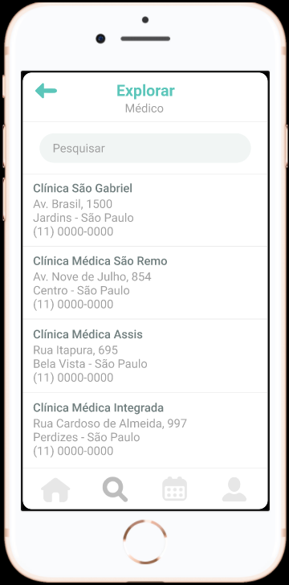
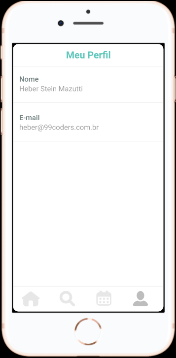
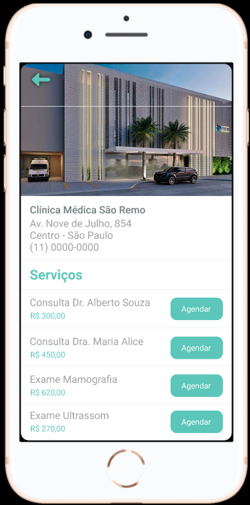
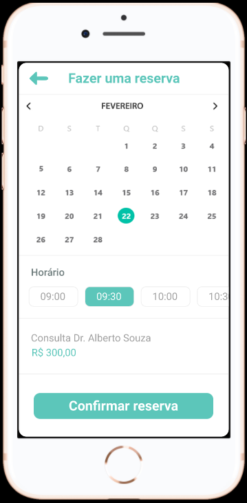

# 📱 Agendei App - React Native

Aplicativo mobile de agendamentos online desenvolvido em React Native como atividade avaliativa da disciplina de Desenvolvimento Mobile.

O projeto simula um sistema de reservas de serviços, permitindo ao usuário explorar estabelecimentos, visualizar categorias, realizar agendamentos e gerenciar suas reservas de forma simples e intuitiva.

---

## 🎯 Objetivo

Desenvolver um aplicativo mobile inspirado em plataformas de agendamento online, focando na construção das telas (UI) e na navegação entre páginas utilizando dados mockados.

---

## 🚀 Tecnologias Utilizadas

- React Native
- Expo
- React Navigation
- JavaScript
- StyleSheet
- Dados Mockados (JSON/Arrays)

---

## 📱 Funcionalidades

- Tela Splash
- Tela de Login
- Home com categorias
- Explorar estabelecimentos
- Tela de Reservas
- Perfil do usuário
- Detalhes do estabelecimento
- Tela de Agendamento
- Navegação entre telas

---

## 🎨 Paleta de Cores

| Cor | Código |
|------|---------|
| Verde Principal | #5cc6ba |
| Cinza Escuro | #717f7f |
| Branco | #ffffff |

---

## 📦 Instalação

### 1️⃣ Clonar o projeto

```bash
git clone https://github.com/Waldemiro20/Agendei.git
```

### 2️⃣ Entrar na pasta

```bash
cd Agendei
```

### 3️⃣ Instalar dependências

```bash
npm install
```

### 4️⃣ Rodar o projeto

```bash
npx expo start
```

---

## 👨‍💻 Equipe de desenvolvedores

Carlos Waldemiro, Devid Lucas, Pedro Lima e Matheus Fernandes

---

## 📄 Licença

Projeto desenvolvido para atividade acadêmica.

## Screenshots

|  |  |  |  |
|---|---|---|---|
|  |  |  |  |
|  |  |  |  |

---
## Links Uteis 

Projeto no Figma - https://www.figma.com/design/YPtZigIiW03djHbfsp0Kj3/Projeto---Agendei---Mobile-App?node-id=0-1&m=dev&t=x7CKhrfHLVfocu5B-1

Imagens do Projeto - https://drive.google.com/drive/folders/1e6JF581AgE0V1oZmk3v5EdDe_PeYIUif